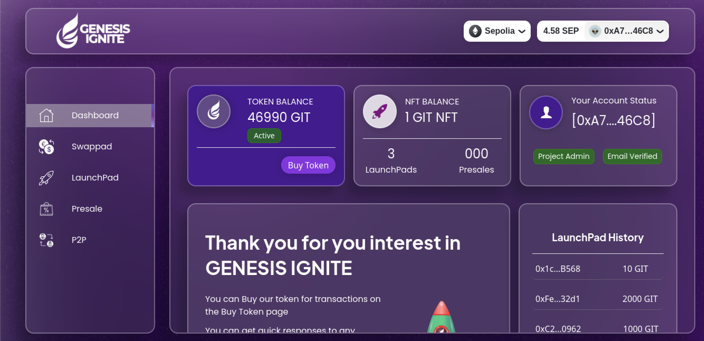
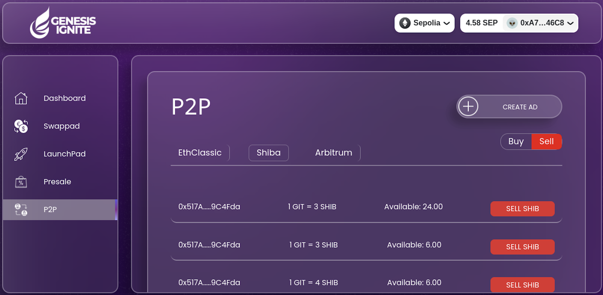
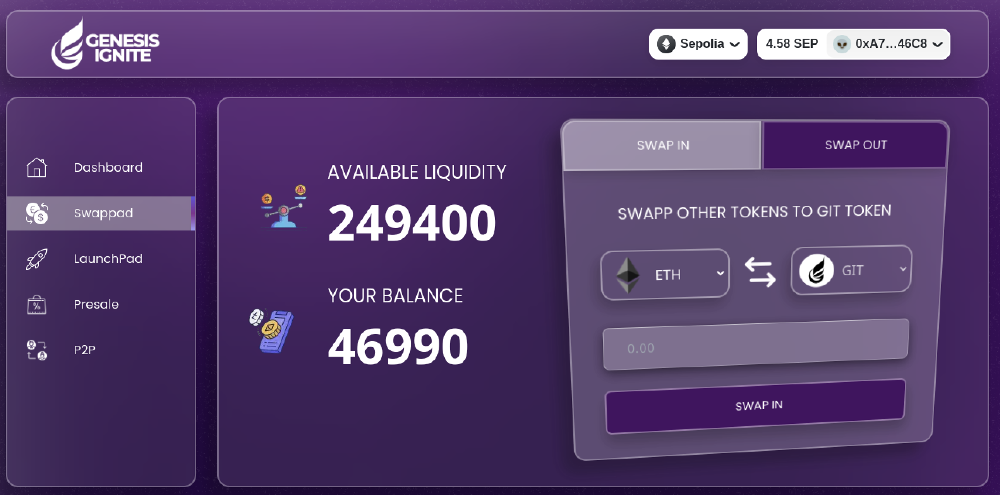

# Bunzz Hackathon Project

## Authors: Idogwu Nonso, Scar-Face, Okolo Uchenna, Mr. Chris, Williams Adepoju

## Title: Genesis Ignite (A Launchpad, Swap and P2P smart contract)

### Contents

- Project Overview
- ScreenShots
- Languages
- FrameWorks

### Overview

Genesis Ignite consists of a five man project team that aims at supporting start-ups to raise necessary funds to advance their unique projects, provide an exchange platform for its users to trade major tokens and a p2p service that enables users trade amongst themselves. The Genesis Ignite team has built a project which consists of three major contract layers;

- a LaunchPad
- a Swap Platform
- a P2P Interface

The project infrastructure consists of a technical Team that evaluates launchpad projects before deciding whether they qualify for listing on the Platform. The success of this phase is further advanced to a pre-sales stage with the former setting the price for current stage.
Through this process, Genesis Ignite amongst raising funds, also brings exposure to the project through its diverse customer base.
The Swap and P2P platforms are essentially aimed at providing a decentralised unique exchange experience to its users.

With a robust front-end design, Genesis Ignite offers the ultimate UI/UX experience to its users with seamless navigation through the differents product offerings on its website.

### Screen Shots

_User Dashboards_

_P2P Section_

_Swap Interface_

### Language

- TypeScript
- JavaScript

### Frameworks

- NextJs
- Wagmi
- RainbowKit
- EthersJs
